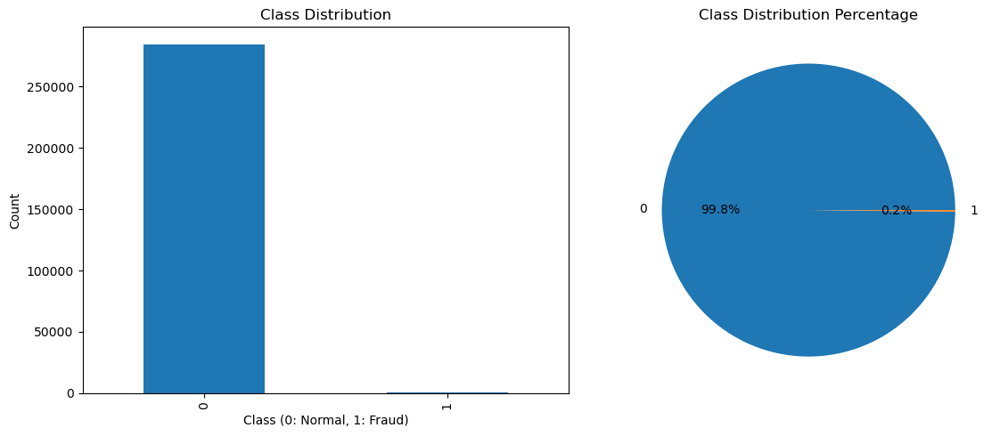
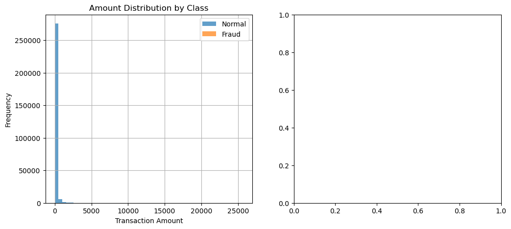
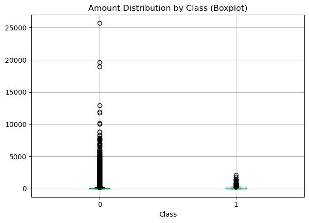
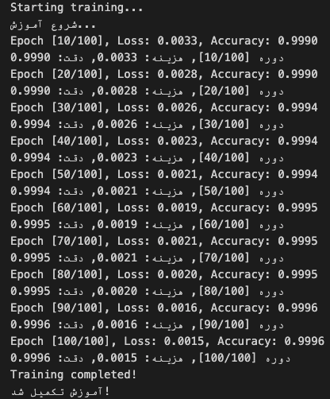
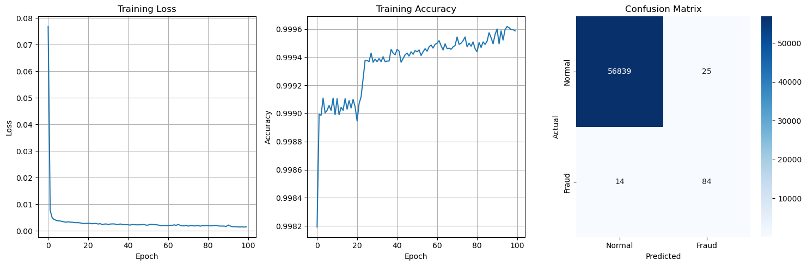
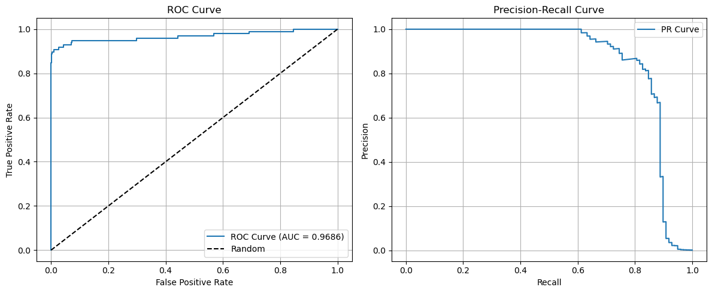
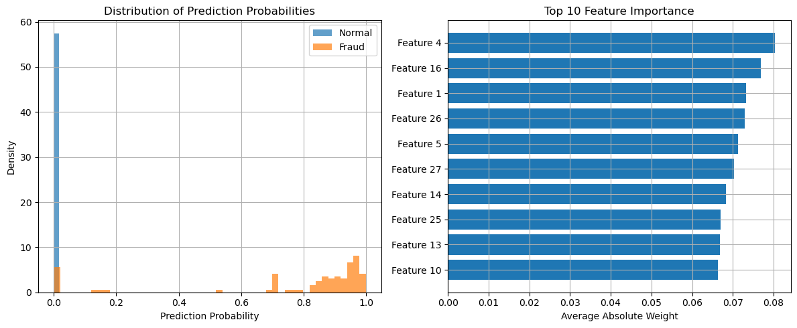

# 💳 Advanced Credit Card Fraud Detection with Deep Neural Networks (PyTorch)

## 📌 Project Overview
[This project implements an **Advanced Fraud Detection System** using the [Credit Card Fraud Dataset](https://www.kaggle.com/mlg-ulb/creditcardfraud) from Kaggle.  
The goal is to identify fraudulent transactions in a **highly imbalanced dataset** using a **deep neural network** designed and trained in **PyTorch**.

---

## 📂 Dataset Information
- **Total Transactions:** `284,807`
- **Features:** `30` numerical features (anonymized via PCA) + `Time` & `Amount`
- **Target Variable:** `Class`  
  - `0` → Normal transaction  
  - `1` → Fraudulent transaction  
- **Fraud Percentage:** `0.17%` (extremely imbalanced)

---

## 🔍 Step-by-Step Process

### **Step 2 — Data Loading & Inspection**
The dataset is loaded from `creditcard.csv` and checked for missing values, feature types, and class imbalance.

| Class | Count  | Percentage |
|-------|--------|------------|
| 0     | 284,315| 99.83%     |
| 1     | 492    | 0.17%      |

---

### **Step 3 — Data Visualization**

#### 🔹 Class Distribution | Class Distribution Percentage

#### 🔹 Amount Distribution by Class

#### 🔹 Amount Distribution by Class (Boxplot)

---

### **Step 4 — Data Preprocessing**
- Train-test split: **80% training**, **20% testing**
- Applied `StandardScaler` — fitted on training data & transformed test data
- Converted data into **PyTorch tensors**

**Training Set Size:** `227,845`  
**Test Set Size:** `56,962`

---

### **Step 5 — Advanced Neural Network Architecture**
AdvancedFraudDetectionNN(
  Linear(30 → 256) → BatchNorm → ReLU → Dropout(0.3)  
  Linear(256 → 128) → BatchNorm → ReLU → Dropout(0.3)  
  Linear(128 → 64) → BatchNorm → ReLU → Dropout(0.3)  
  Linear(64 → 32) → BatchNorm → ReLU → Dropout(0.3)  
  Linear(32 → 1) → Sigmoid  
)  
**Total Parameters:** 52,161
Techniques used:
- **Batch Normalization** (training stability)
- **Dropout Regularization** (prevent overfitting)

---

### **Step 6 — Loss Function & Optimizer**
- **Loss Function:** `BCELoss`
- Adaptive learning rate using `ReduceLROnPlateau`
- `Adam` optimizer with `weight_decay=1e-5`
- Class weights to handle class imbalance:  
  - Normal: `0.5009`  
  - Fraud: `289.1434`

---

### **Step 7 — DataLoader Creation**
- **Batch Size:** 512
- Training Batches: 446
- Test Batches: 112

---

### **Step 8 — Training**
100 training epochs achieved **near-perfect accuracy**:

Epoch 100 → Loss: 0.0015, Accuracy: 0.9996

---

### **Step 9 — Model Evaluation**
#### **Final Metrics:**
| Metric      | Score   |
|-------------|---------|
| Accuracy    | 0.9993  |
| Precision   | 0.7706  |
| Recall      | 0.8571  |
| F1-Score    | 0.8116  |
| AUC-ROC     | 0.9686  |

**Classification Report:**

| Class  | Precision | Recall | F1-score | Support |
|--------|-----------|--------|----------|---------|
| Normal | 1.00      | 1.00   | 1.00     | 56864   |
| Fraud  | 0.77      | 0.86   | 0.81     | 98      |

### **Step 10 — Results Visualization**
#### 🔹 Training Curves & Confusion Matrix

#### 🔹 ROC & Precision-Recall Curve

#### 🔹 Prediction Probabilities & Feature Importance

---

### **Step 11 — Testing on New Data**
Example predictions on 5 random transactions — all correctly identified as **Normal**.

---

### **Step 12 — Model Saving & Loading**
The trained model and fitted scaler are saved for future use:
python
model, scaler = load_fraud_model('fraud_detection_model.pth', 'fraud_detection_scaler.pkl')

---

## 📊 Final Summary
| Feature | Description |
|---------|-------------|
| **Neural Network** | Deep architecture with BatchNorm, Dropout |
| **Data Handling** | Proper normalization, train-test split |
| **Optimization** | Adam + LR scheduling |
| **Performance** | AUC = **0.9686**, high recall for fraud detection |
| **Persistence** | Model & scaler saved for reuse |

**✅ This system effectively detects fraudulent transactions with extremely high accuracy, while maintaining a healthy balance between precision and recall.**

---

## ⚙️ How to Run
1. Clone the repository
2. Install dependencies:
bash
pip install pandas numpy torch scikit-learn matplotlib seaborn
3. Place `creditcard.csv` in the project directory.
4. Run the Jupyter Notebook:
bash
jupyter notebook Cloud4.ipynb

---

## 📜 License
This project is open-source and available under the **MIT License**.

---